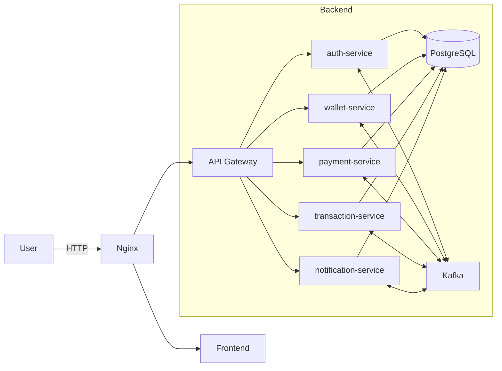

# 💳 MicroPay – Event-Driven Digital Wallet System


---

## 🚀 Overview

**MicroPay** is a backend-first, cloud-native digital wallet and payment processing system built using **microservices architecture** and **event-driven design**.

It simulates real-world fintech systems by focusing on:

* Distributed transactions
* Eventual consistency
* Fault tolerance
* Scalable service communication

---

## 🧩 Architecture



---

## 🧠 Core Services

### 👤 Auth Service

* User registration & authentication
* JWT-based security
* Publishes user events

### 💼 Wallet Service

* Wallet creation per user
* Balance management
* Consumes user/payment events

### 💸 Payment Service

* Handles wallet-to-wallet payments
* Business validations
* Produces payment events

### 📒 Transaction Service

* Maintains transaction ledger
* Ensures auditability

### 🔔 Notification Service

* Sends notifications (email/SMS-ready)
* Consumes domain events

### 🌐 API Gateway

* Central entry point
* Routing + filtering

---

## 🔁 Event-Driven Communication

* Apache Kafka used for async communication
* Shared DTOs via `micropay-events` module
* Idempotent consumers
* Eventual consistency model

---

## 🛠 Tech Stack

### Backend

* Java 17
* Spring Boot
* Spring Security
* Spring Data JPA

### Microservices

* Spring Cloud Gateway
* Eureka (optional)

### Messaging

* Apache Kafka

### Database

* PostgreSQL
* Database-per-service pattern

### DevOps

* Docker & Docker Compose
* GitHub Actions (CI/CD)
* AWS (EC2, S3, CloudFront, ECR)

---

## 📂 Project Structure

```
MicroPay
├── micropay-events        # Shared event DTOs
├── auth-service
├── wallet-service
├── payment-service
├── transaction-service
├── notification-service
├── api-gateway
├── infrastructure
│   ├── docker
│   └── terraform
├── tests
└── README.md
```

---

## ⚙️ Local Setup

### 1. Clone repository

```bash
git clone https://github.com/your-username/micropay.git
cd micropay
```

### 2. Setup environment

```bash
cp .env.example .env
```

### 3. Run using Docker

```bash
cd infrastructure/docker
docker compose -f docker-compose.prod.yml --env-file ../../.env up -d --build
```

### 4. Access services

* Frontend: [http://localhost](http://localhost)
* API Gateway: [http://localhost/api](http://localhost/api)
* Health Check: [http://localhost/api/actuator/health](http://localhost/api/actuator/health)

---

## 📊 Observability

* Prometheus: [http://localhost:9090](http://localhost:9090)
* Grafana: [http://localhost:3001](http://localhost:3001)

All services expose:

```
/actuator/prometheus
```

---

## 📄 API Documentation

Swagger UI available per service:

* Auth: [http://localhost:8081/swagger-ui.html](http://localhost:8081/swagger-ui.html)
* Wallet: [http://localhost:8083/swagger-ui.html](http://localhost:8083/swagger-ui.html)
* Payment: [http://localhost:8084/swagger-ui.html](http://localhost:8084/swagger-ui.html)
* Transaction: [http://localhost:8085/swagger-ui.html](http://localhost:8085/swagger-ui.html)
* Notification: [http://localhost:8086/swagger-ui.html](http://localhost:8086/swagger-ui.html)

---

## 🧪 Testing

### Smoke Tests

```
tests/smoke/api-smoke.test.http
```

### Load Testing (k6)

```bash
k6 run tests/load/k6-smoke.js
```

---

## ☁️ AWS Deployment (Free Tier)

### Infrastructure

* EC2 (t2.micro)
* Docker Compose deployment
* S3 + CloudFront (frontend)
* ECR (container registry)

### Deploy using Terraform

```bash
cd infrastructure/terraform
terraform init
terraform apply
```

---

## 🔐 Security

* JWT-based authentication
* Stateless services
* Gateway-level validation

---

## ⚠️ Important Notes

* All shared events are centralized in `micropay-events`
* No DTO duplication across services
* BOOT-INF should NOT exist in source
* Each service owns its database schema

---

## 🧠 Key Learnings

* Microservices communication patterns
* Event-driven architecture
* Distributed system design
* CI/CD pipelines
* Cloud deployment (AWS Free Tier)

---

## 🚀 Future Improvements

* Add Redis caching
* Implement circuit breakers (Resilience4j)
* Add distributed tracing (Zipkin/Jaeger)
* Kubernetes deployment

---

## 👨‍💻 Author

Manoj Kushwah

---

## ⭐ If you like this project

Give it a star ⭐ on GitHub!
